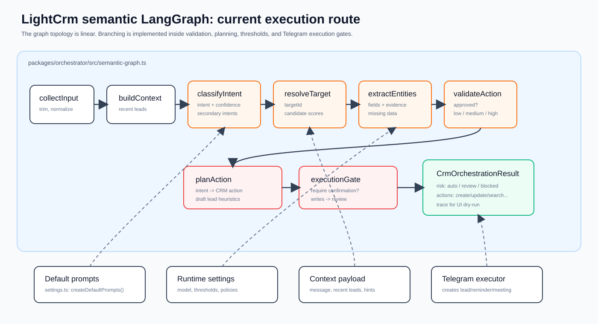
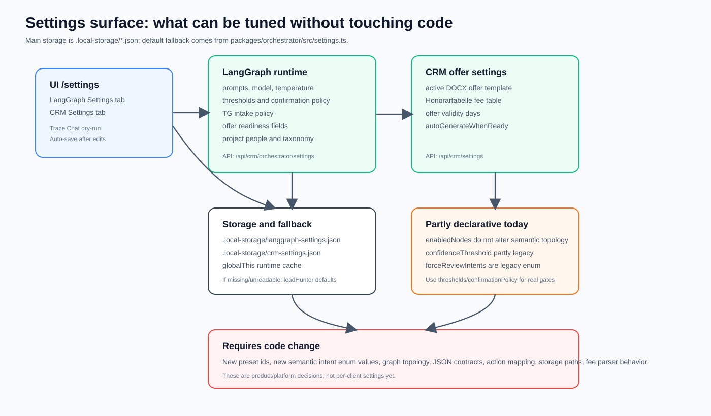
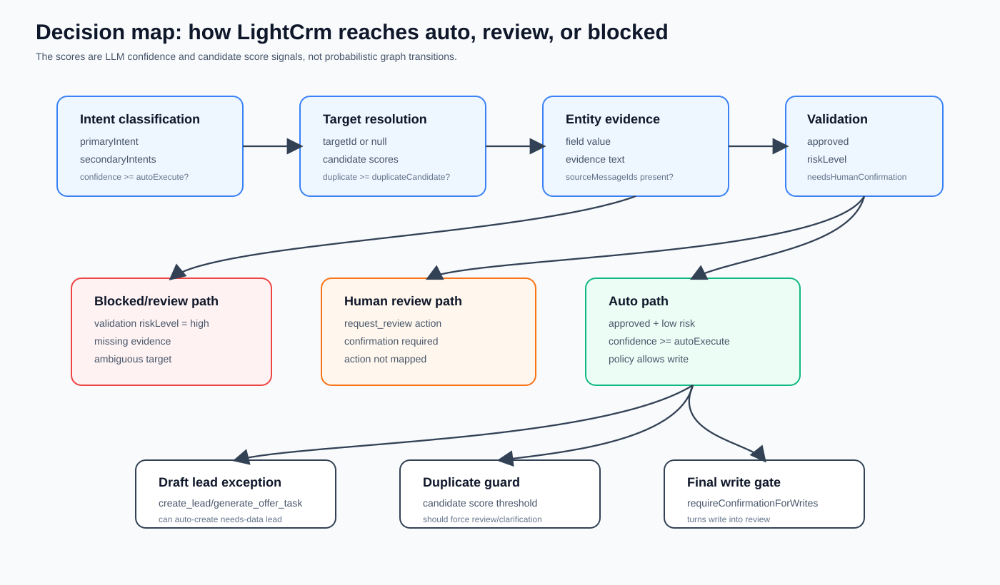

# LightCrm LangGraph/CRM Audit

Date: 2026-06-16
Workspace audited: `C:\repos\LightCrm`
Scope: LangGraph orchestration, runtime settings, prompts/defaults, Telegram/API command paths, tunability without code changes.

## Visuals

## Executive Summary

LightCrm is currently tuned as an operational CRM assistant for an architecture bureau. Its strongest path is Telegram-style intake: forwarded client requests, attachments, voice/images/PDF summaries, lead creation, lead updates, reminders, meetings, and commercial offer readiness.

The current LangGraph implementation is meaning-first but structurally linear. The graph always walks the same semantic route:

`collect_input -> build_context -> classify_intent -> resolve_target -> extract_entities -> validate_action -> plan_action -> execution_gate`

The branching does not live in LangGraph conditional edges yet. It lives inside LLM JSON outputs, thresholds, duplicate heuristics, policy flags, and `planAction()`/`executionGate()`. This is workable, but for client-facing auditability the system should present this as a decision pipeline with gates, not as a probabilistic graph with explicit route alternatives.

Most important finding: the system is highly configurable for prompts, thresholds, Telegram intake policy, commercial offer readiness, project people, and dry-run testing. But topology, action mapping, intent enum expansion, node contracts, and some UI-visible flags still require code changes or are only partly connected to runtime behavior.

## What The System Is Optimized For

The default role says: AI Chief of Staff for an architecture bureau. The domain shape confirms it:

- lead capture from Telegram/manual/import channels;
- architecture/project fields: client, project, address, request type, BGF/area, manual gross price;
- internal project people so directors/developers are not mistaken for clients;
- commercial offer readiness with DOCX templates and Honorartabelle fee tables;
- draft lead creation even when contacts are missing;
- careful handling of active/recent leads so a recent lead is a magnet, not a supermagnet.

This is not a generic CRM bot yet. It is a bureau intake and offer-prep assistant that can be generalized, but the current defaults are very intentionally architecture/offer-oriented.

## Current Execution Model

Entry point:

- `packages/orchestrator/src/graph.ts`
- `runCrmOrchestration()`

If `settings.semanticMode` is true, execution delegates to:

- `packages/orchestrator/src/semantic-graph.ts`
- `runSemanticCrmOrchestration()`

If `semanticMode` is false, the legacy graph runs, but it is effectively disabled and returns review/request_review. So the real system is the semantic graph.

Semantic nodes:

- `collectInput`: trims and normalizes incoming text.
- `buildContext`: packages message, recent leads, recent messages, relationship hints.
- `classifyIntent`: LLM JSON call for primary/secondary semantic intent.
- `resolveTarget`: LLM JSON call to decide existing lead/client/project/task vs new opportunity.
- `extractEntities`: LLM JSON call for fields with confidence, evidence, source ids.
- `validateAction`: LLM JSON call for safety/risk.
- `planAction`: deterministic mapping from semantic result to CRM action(s).
- `executionGate`: deterministic final confirmation gate.

Trace events are returned to the caller and shown in the settings dry-run UI. They are not yet persisted as durable audit records.

## Decision Mindset

The system follows this mindset:

1. Understand the whole message, not isolated keywords.
2. Treat recent lead context as useful but not decisive.
3. Separate intent, target, entity extraction, validation, and action planning.
4. Prefer review/clarification when target identity, duplicate risk, or write safety is unclear.
5. Allow draft lead creation when a new opportunity is evident even if contact/project data is incomplete.
6. Require evidence for offer readiness fields when configured.

Important nuance: the "probabilities" are not real transition probabilities. They are LLM confidence scores and candidate similarity scores used against thresholds.

Key gates:

- `thresholds.autoExecute`: minimum intent confidence for auto risk in `riskFromValidation()`.
- `thresholds.duplicateCandidate`: candidate score that blocks new-lead auto-create.
- `confirmationPolicy.allowAutoCreateLead`: allows or stops lead creation.
- `confirmationPolicy.allowAutoCreateReminder`: allows or stops reminder creation.
- `confirmationPolicy.requireConfirmationForWrites`: turns writes into review at final gate.
- `tgIntakePolicy.actionStrictness`: `preview_first`, `strong_evidence`, or `auto_create_drafts`.
- `offerReadiness.requireEvidenceForOfferFields`: requires evidence/source ids for offer fields.

## Intent And Action Coverage

Semantic intents currently supported by schema/settings:

- `create_lead`
- `search_leads`
- `update_lead`
- `create_task`
- `create_reminder`
- `create_meeting`
- `attach_document`
- `generate_offer_task`
- `fill_offer_fields`
- `add_lead_note`
- `system_help`
- `ask_clarification`
- `no_action`

Executable action mapping currently covers:

- `create_lead -> create_lead`
- `search_leads -> search_leads`
- `update_lead -> update_lead`
- `add_lead_note -> update_lead`
- `fill_offer_fields -> update_lead`
- `create_reminder -> create_reminder`
- `create_meeting -> create_meeting`
- special case: `generate_offer_task` can become `create_lead` when it is project-only offer intake with evidence.

Gaps:

- `create_task`, `attach_document`, `system_help`, and `no_action` can be classified but do not have a direct executable mapping in `actionTypeByIntent`.
- `actionPlanner` exists in prompts/settings but the current graph does not use a separate LLM planner node. Planning is deterministic code in `planAction()`.

## Runtime Settings

Settings UI:

- `apps/web/app/settings/settings-page.tsx`

LangGraph settings API:

- `GET /api/crm/orchestrator/settings`
- `PUT /api/crm/orchestrator/settings`
- `apps/web/app/api/crm/orchestrator/settings/route.ts`

Dry-run API:

- `POST /api/crm/orchestrator/dry-run`
- accepts a test message and optional settings override.

Storage:

- `.local-storage/langgraph-settings.json`
- in-memory cache: `globalThis.lightCrmLangGraphSettings`

Validation:

- `apps/web/app/api/crm/orchestrator/settings-schema.ts`
- Zod validates enum values, temperature, thresholds, bundle wait, required nested objects.

Configurable without code:

- active preset/custom settings;
- model and temperature;
- `semanticMode`;
- all main prompts;
- taxonomy fields and required fields per action within existing enum constraints;
- thresholds;
- confirmation policy;
- Telegram intake policy;
- offer readiness flags and existing field metadata;
- internal project people;
- dry-run trace behavior via settings.

Not configurable without code:

- graph topology and node names;
- new semantic intent enum values;
- new preset ids;
- LLM JSON contracts;
- action mapping and planning heuristics;
- storage paths;
- fee table parser behavior and fallback assumptions;
- some UI omissions such as `vatRate`, offer field key/label creation, new offer readiness fields.

Partly connected or legacy-looking settings:

- `enabledNodes` is shown in UI/API but does not alter semantic graph topology.
- `confidenceThreshold` exists, but semantic auto behavior mainly uses `thresholds.autoExecute`.
- `forceReviewIntents`, `autoCreateLead`, `autoCreateReminder`, `reviewNameOnlyUpdates` are present, but semantic runtime relies more directly on `confirmationPolicy` and thresholds.

## Defaults And Fallbacks

Main defaults:

- `packages/orchestrator/src/settings.ts`
- `createDefaultPrompts()`
- `createDefaultTaxonomy()`
- `createDefaultProjectPeople()`
- `createDefaultTgIntakePolicy()`
- `createDefaultOfferReadiness()`
- `LANGGRAPH_PRESETS`
- `DEFAULT_LANGGRAPH_SETTINGS = leadHunter`

Available presets:

- `leadHunter`: aggressive TG lead capture; default.
- `mailAnalyst`: conservative about new leads; better for forwarded mail/evidence updates.
- `riskAuditor`: high threshold, most writes in review.
- `fastOperator`: low-friction speed/testing mode.
- `relationshipKeeper`: balanced updates/reminders/linking.

If `.local-storage/langgraph-settings.json` is missing or unreadable, the system falls back to default `leadHunter` settings.

If custom prompt fields are missing in a partial merge, `mergeLangGraphSettings()` fills them from the selected preset/default. Through the public PUT API, however, the settings object is validated as a full runtime object.

If `OPENAI_API_KEY` is missing, semantic mode fails at LLM provider creation/runtime with a clear error.

CRM commercial offer settings:

- `.local-storage/crm-settings.json`
- `.local-storage/commercial-offers/active-template.docx`
- default `vatRate = 0.19`
- default `offerValidityDays = 90`
- default/fallback fee table rows exist in code.

## Prompt Architecture

Base runtime prompts are in `packages/orchestrator/src/settings.ts`:

- `systemRole`
- `intentClassifier`
- `entityExtractor`
- `targetResolver`
- `validationGuard`
- `actionPlanner`

Final system prompt is assembled in `semanticSystemPrompt()`:

1. `settings.prompts.systemRole`
2. `projectPeoplePrompt(settings)`
3. `tgIntakePolicyPrompt(settings)`
4. `offerReadinessPrompt(settings)`
5. node-specific instruction and JSON contract

This means changing a prompt in settings can materially change behavior without changing code. But some instructions are still code-generated from structured settings, especially Telegram policy, offer readiness, and project people.

Separate attachment analysis prompt:

- `packages/telegram-bot/src/attachment-analysis.ts`
- `analysisSystemPrompt()`

## Command Channels

Web/API:

- `/api/crm/orchestrator/dry-run`
- `/api/crm/lead-intake`
- `/api/crm/lead-intake/upload`
- `/api/crm/lead-intake/undo`
- CRM CRUD/settings endpoints under `/api/crm/*`

Telegram:

- polling in `packages/telegram-bot/src/bot.ts`
- slash commands in `packages/telegram-bot/src/bot-core.ts`: `/start`, `/help`, `/crm`, `/search`, `/newlead`
- inline callbacks: attachment decisions, CRM open/search/show, undo, summary, downloads, offer
- media groups and delayed bundling in `packages/telegram-bot/src/media-groups.ts`

Execution after orchestration happens in Telegram bot code:

- creates leads;
- updates leads;
- creates reminders;
- creates calendar events;
- uploads/attaches files;
- generates commercial offer documents.

## Strengths

- Good separation between semantic understanding and deterministic final gates.
- Settings UI includes dry-run trace, which is exactly the right operator tool.
- Prompts, thresholds, policies, people, and taxonomy are runtime-editable.
- Draft lead creation is pragmatic for real-world messy Telegram intake.
- Internal project people reduce common CRM extraction mistakes.
- Tests cover a lot of semantic behavior, including draft leads, offer intake, meetings, missing fields, and JSON schema parsing.

## Risks

- Graph is visually linear, so current "paths" are hidden inside code and prompts.
- Some settings look configurable but have weak/no effect on semantic runtime.
- LLM JSON mode is validated by Zod after response, but not using stricter schema-native structured outputs.
- Trace is visible in dry-run but not persisted with lead/audit history.
- Duplicate handling depends on LLM target candidate scores and prompts.
- Some Russian strings in source appear mojibaked, which hurts trace readability and audit confidence.
- `system_help`, `attach_document`, `create_task`, and `no_action` are not fully first-class executable paths.
- CRM settings server validation is weaker than LangGraph settings validation.

## Recommended Improvements

Priority 1:

- Persist orchestration audit records: `settings.id`, model, prompt version/hash, input source ids, intent, risk, action types, trace node statuses, duplicate candidates, and final executor result.
- Add a correlation id/intake id across Telegram update, media group, orchestration result, lead create/update, attachment upload, and audit log.
- Make `enabledNodes`, `confidenceThreshold`, `forceReviewIntents`, `autoCreateLead`, and `autoCreateReminder` either functional in semantic mode or clearly legacy/hidden.
- Normalize source encoding for Russian trace/settings text and add a simple test/scan to prevent mojibake.

Priority 2:

- Add explicit LangGraph conditional edges or a separate decision graph layer for `auto`, `review`, `blocked`, `clarification`.
- Create a typed action-planner schema/node or rename/remove `prompts.actionPlanner` until it is actually used.
- Make `system_help`, `attach_document`, `create_task`, and `no_action` explicit product paths.
- Move Telegram examples and edge-case policies into structured settings, not only hardcoded prompt construction.

Priority 3:

- Add server-side Zod validation for CRM commercial settings.
- Expose `vatRate`, offer field key/label editing, and add/remove offer readiness fields in UI if client customization matters.
- Add a visual route explorer based on dry-run trace: route, confidence, target candidates, extracted fields, missing evidence, final gate.
- Switch OpenAI calls to stricter structured output semantics when the chosen model/API supports it.

## Suggested Client-Tuning Mindset

For a client rollout, tune in this order:

1. Choose preset posture: aggressive intake, conservative audit, relationship updates, or fast operations.
2. Define business ontology: valid intents, entity fields, required fields per action.
3. Define write policy: when auto-create is acceptable, when review is mandatory.
4. Define duplicate policy: how similar is too similar for auto-create.
5. Define internal people and roles so forwarded messages are interpreted correctly.
6. Define examples and counterexamples in prompts/settings.
7. Run dry-run traces on real transcripts before enabling auto writes.
8. Persist audit traces before expanding automation.

## Source Map

Key files:

- `packages/orchestrator/src/semantic-graph.ts`
- `packages/orchestrator/src/graph.ts`
- `packages/orchestrator/src/settings.ts`
- `packages/orchestrator/src/schemas.ts`
- `packages/orchestrator/src/types.ts`
- `packages/orchestrator/src/llm.ts`
- `apps/web/app/api/crm/orchestrator/settings-store.ts`
- `apps/web/app/api/crm/orchestrator/settings-schema.ts`
- `apps/web/app/api/crm/orchestrator/settings/route.ts`
- `apps/web/app/api/crm/orchestrator/dry-run/route.ts`
- `apps/web/app/settings/settings-page.tsx`
- `packages/telegram-bot/src/bot-core.ts`
- `packages/telegram-bot/src/attachment-analysis.ts`
- `packages/telegram-bot/src/media-groups.ts`
- `docs/langgraph-semantic-settings.md`
